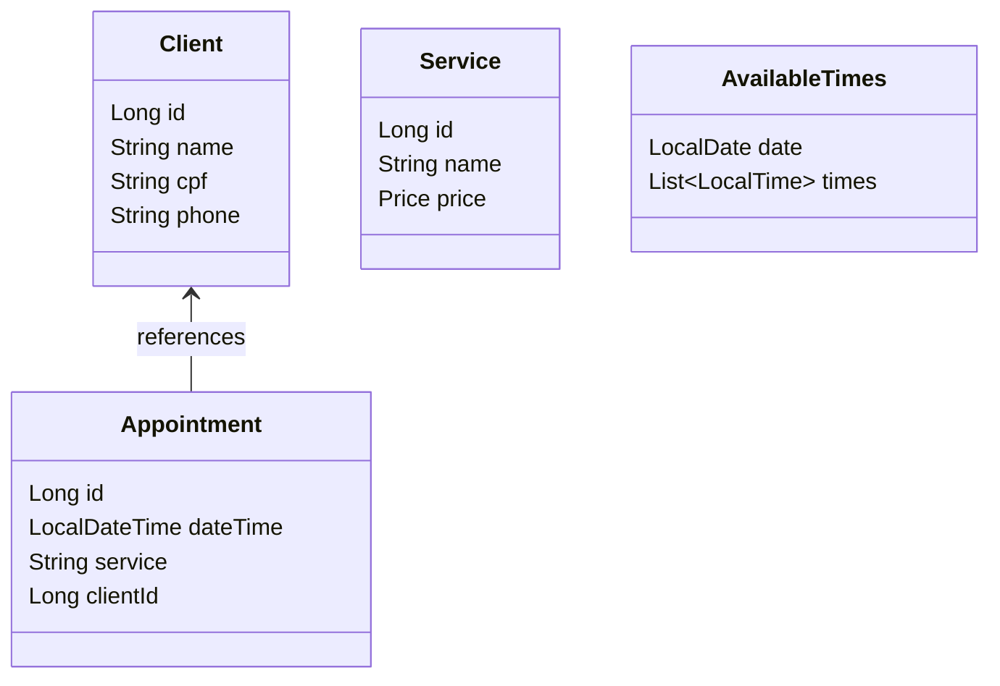

# Barbearia
Java RESTful API criada para o desafio da DIO.

## Diagrama de Classe

```mermaid
classDiagram
    class Client {
        Long id
        String name 
        String cpf 
        String phone  
    }

    class Appointment {
        Long id
        LocalDateTime dateTime
        String service
        Long clientId
    }

    class Service {
        Long id
        String name
        Price price
    }

    class AvailableTimes {
        LocalDate date
        List~LocalTime~ times
    }

    Client <-- Appointment : references
```
